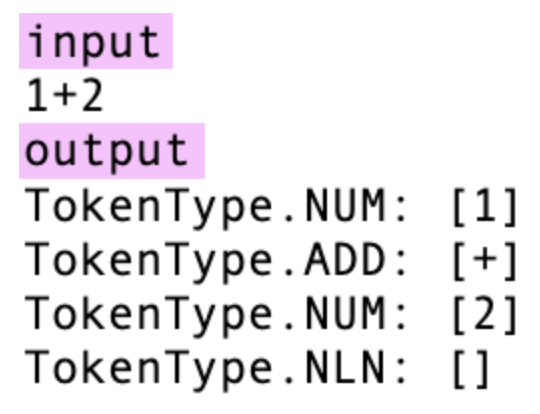
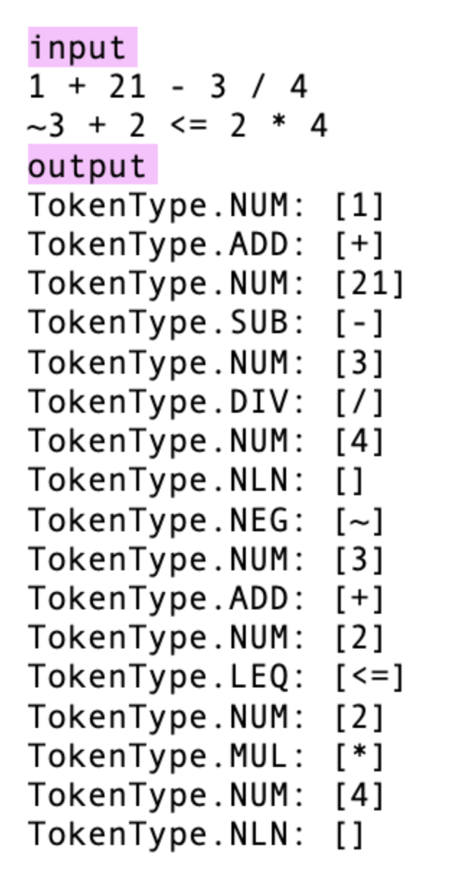
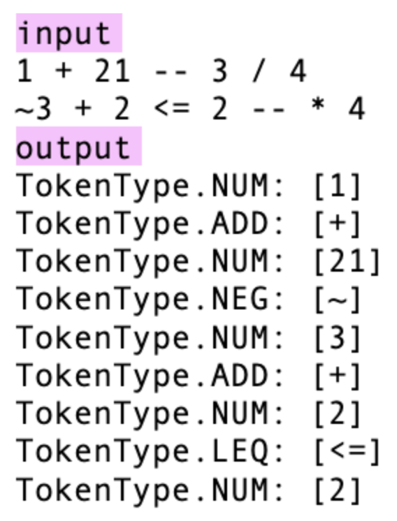
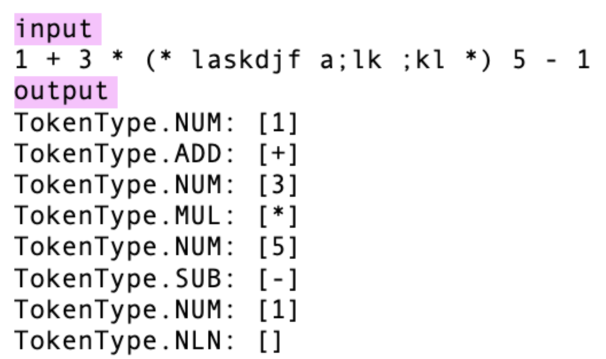
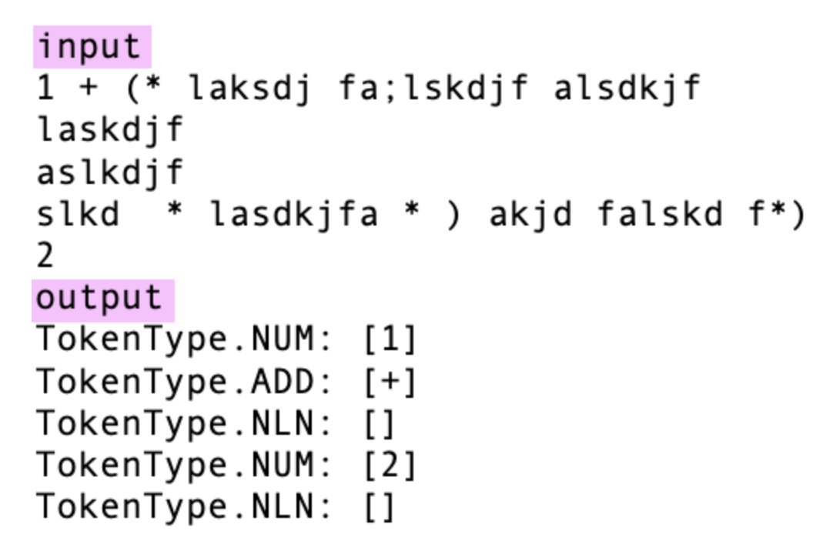
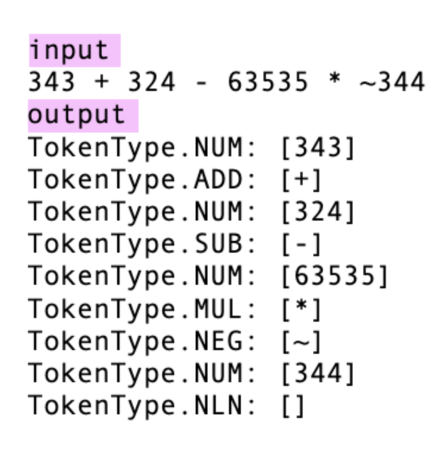
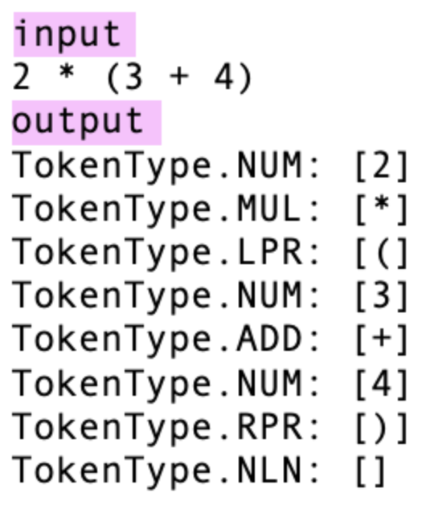

# cool_compiler

## Assignment Prompt:

O objetivo deste trabalho é implementar um analisador léxico para um subconjunto da linguagem cool, que descreve expressões aritméticas (vide Seção 7.12 do manual da linguagem). Seu analisador léxico deverá reconhecer os seguintes tokens:

EOF: fim de arquivo
NLN: quebra de linha
WSP: espaço em branco
COM: comentário
NUM: número inteiro
EQL: sinal de igual (=)
ADD: sinal de adição (+)
SUB: sinal de subtração (-)
MUL: sinal de multiplicação (*)
DIV: sinal de divisão (/)
LEQ: sinal de menor ou igual (<=)
LTH: sinal de menor que (<)
NEG: sinal de menos unário
NOT: negação booleana (not)
LPR: parênteses esquerdo
RPR: parênteses direito
TRU: a constante booleana "true"
FLS: a constante booleana "false"

Comentários podem ser de dois tipos:
- Comentário de linha, que começa com um duplo sinal de menos (--). Um comentário de linha faz com que o resto da linha seja ignorada.
- Comentário de bloco, que contém texto entre (* e *). Todo o texto entre esses marcadores deve ser ignorado.
- 
Uma parte da implementação já está pronta para você. Você deverá reusar a definição de tokens (classe TokenType) e a implementação de Tokens (classe Token). Seu objetivo será implementar uma classe Lexer. Esta classe é um gerador de tokens. O método de geração de tokens segue abaixo:

    def tokens(self):
        token = self.getToken()
        while token.kind != TokenType.EOF:
            if token.kind != TokenType.WSP and token.kind != TokenType.COM:
                yield token
            token = self.getToken()

Note que o gerador de tokens retorna qualquer tipo de token, exceto espaços em branco e comentários. Seu código será testado pelo driver abaixo:

    if __name__ == "__main__":
        lexer = Lexer(sys.stdin.read())
        for token in lexer.tokens():
            print(f"{token.kind}: [{token.text}]")

Em outras palavras, os testes mostrados na figura abaixo deverão funcionar:

Parte do trabalho está implementada para você. Você deverá fazer o upload de dois arquivos: Lexer.py e driver.py. Você não precisa alterar nada em driver.py.